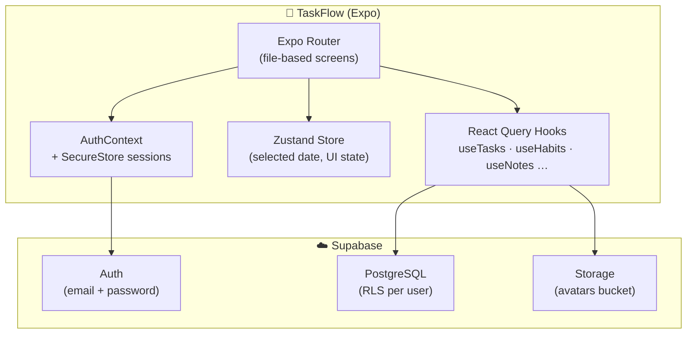

<p align="center">
  
</p>

<h1 align="center">TaskFlow</h1>

<p align="center">
  <strong>Your life, organized — one beautiful screen at a time.</strong>
</p>

<p align="center">
  TaskFlow is a cross-platform productivity app that unifies tasks, habits, goals, notes, focus sessions, and nutrition into a single daily command center. Built with React Native and Expo, backed by Supabase, and designed for people who want clarity without clutter.
</p>

<p align="center">
  
  
  
  
  
</p>

---

## Why TaskFlow?

Most productivity apps solve one problem well. TaskFlow connects the dots.

| Pain point | TaskFlow's answer |
|---|---|
| Scattered to-do lists | Unified **Home** dashboard with tasks, habits, and goals in one glance |
| Habits that fade | **Streak tracking**, daily rings, and smart reminders |
| Context switching | Built-in **Pomodoro focus mode** tied to individual tasks |
| Planning in the dark | **Calendar** with priority-colored dots and agenda view |
| Starting from scratch | **Discover** templates for work, fitness, mindfulness, and nutrition |
| Health + productivity silos | **Nutrition tracker** with macro goals alongside your day |

---

## Features

### Daily Command Center
The home screen is the heart of TaskFlow. A triple-ring progress visualization tracks your tasks, habits, and goals for the selected day. Scroll through suggested tasks, in-progress work, habit rings, and recent notes — all synchronized to the date you pick on the interactive week strip.

### Tasks
Full-featured task management with priorities (urgent → low), difficulty levels, categories, due dates and times, subtasks, tags, repeat rules, and reminders. Quick-add on the Tasks tab, rich creation modals, swipe-friendly list items, and smart filtering by category, priority, and completion status.

### Habits
Build routines with custom icons, target days, difficulty, optional numeric goals, and color-coded streak rings. Toggle completions per day and watch your consistency compound.

### Goals & Notes
Track long-term goals with progress percentages and target dates. Capture quick thoughts in a lightweight notes system with tags — surfaced right on your home dashboard.

### Focus Mode
Launch a distraction-free Pomodoro session from any task. Animated circular timer, work/break phases, and automatic logging of focus minutes back to your task history via Supabase.

### Calendar
Month and agenda views with multi-dot date markers colored by task priority. Tap any day to see a time-sorted agenda of what's due.

### Discover
Browse curated template packs — Work & Productivity, Fitness & Health, Mindfulness, and Nutrition — and add pre-built tasks and habits to your account in one tap.

### Nutrition
Log meals across Breakfast, Lunch, Dinner, and Snacks. Track calories, protein, carbs, and fat against daily targets with visual macro bars.

### Profile & Settings
Personal information, avatar upload, notification preferences, privacy controls, support contact, and in-app bug reporting. Session stats show tasks completed, habit count, best streak, and days active.

### Authentication
Secure email + password auth powered by Supabase, with persistent sessions stored via `expo-secure-store` so you stay signed in across app restarts.

---

## Screenshots

> Add device screenshots here before publishing — recommended captures: Home (Daily Command Center), Tasks list, Calendar, Focus Mode, and Profile.

| Home | Tasks | Calendar | Focus |
|:---:|:---:|:---:|:---:|
| *screenshot* | *screenshot* | *screenshot* | *screenshot* |

---

## Tech Stack

| Layer | Technology |
|---|---|
| **Framework** | [Expo SDK 54](https://docs.expo.dev/) + [React Native 0.81](https://reactnative.dev/) |
| **Navigation** | [Expo Router 6](https://docs.expo.dev/router/introduction/) (file-based routing) |
| **Backend** | [Supabase](https://supabase.com/) — Auth, PostgreSQL, Row Level Security, Storage |
| **Server state** | [TanStack React Query 5](https://tanstack.com/query) |
| **Client state** | [Zustand 5](https://zustand.docs.pmnd.rs/) |
| **UI** | Custom design system, [Inter](https://fonts.google.com/specimen/Inter) typeface, Material Icons |
| **Animations** | [Reanimated 4](https://docs.swmansion.com/react-native-reanimated/) + React Native Animated |
| **Lists** | [FlashList](https://shopify.github.io/flash-list/) |
| **Gestures** | [Gesture Handler](https://docs.swmansion.com/react-native-gesture-handler/) + [Bottom Sheet](https://gorhom.dev/react-native-bottom-sheet/) |
| **Calendar** | [react-native-calendars](https://github.com/wix/react-native-calendars) |

---

## Architecture



### Data model highlights

The Postgres schema (`supabase/migrations/`) includes:

- `profiles`, `user_settings` — user identity and preferences
- `tasks`, `subtasks`, `lists`, `tags`, `task_tags` — task management
- `habits`, `habit_completions` — habit tracking with daily logs
- `notes`, `goals` — knowledge and long-term objectives
- `focus_sessions` — Pomodoro history per task
- `nutrition_daily`, `meal_items` — macro tracking
- `bug_reports`, `user_template_additions` — support and discover analytics

Every table is protected with **Row Level Security** so users only access their own data.

---

## Project Structure

```
TaskFlow/
├── app/                        # Expo Router screens
│   ├── (auth)/                 # Login, signup, forgot password
│   ├── (tabs)/                 # Home, Tasks, Calendar, Discover, Profile
│   ├── task/[id].jsx           # Task detail
│   ├── task-new.jsx            # Create / edit task modal
│   ├── habit/[id].jsx          # Habit detail
│   ├── habit-new.jsx           # Create habit modal
│   ├── note/[id].jsx           # Note editor
│   ├── focus/[id].jsx          # Pomodoro focus mode
│   ├── nutrition.jsx           # Meal & macro tracker
│   └── …                       # Settings, profile, bug report
├── components/
│   ├── ui/                     # TaskItem, HabitRing, FABMenu, …
│   └── layout/                 # ScreenHeader, SettingsRow
├── lib/
│   ├── api/                    # Supabase data access layer
│   ├── hooks/                  # React Query hooks
│   ├── constants/              # Discover templates
│   ├── AuthContext.jsx         # Session management
│   ├── supabase.js             # Supabase client
│   ├── store.js                # Zustand store
│   └── theme.js                # Design tokens
├── supabase/
│   └── migrations/             # Database schema + RLS
├── assets/                     # App icon, splash, favicon
├── app.json                    # Expo config
└── package.json
```

---

## Getting Started

### Prerequisites

- [Node.js](https://nodejs.org/) 18+
- [Expo Go](https://expo.dev/go) on your device, or Xcode / Android Studio for simulators
- A [Supabase](https://supabase.com/) project (free tier works)

### 1. Clone and install

```bash
git clone <your-repo-url>
cd TaskFlow
npm install
```

### 2. Configure environment

```bash
cp .env.example .env
```

Fill in your Supabase credentials:

```env
EXPO_PUBLIC_SUPABASE_URL=https://your-project.supabase.co
EXPO_PUBLIC_SUPABASE_ANON_KEY=your-anon-key
```

### 3. Set up the database

Run the migration in `supabase/migrations/20260622000000_initial_schema.sql` via:

- **Supabase Dashboard** → SQL Editor → paste and run, or
- **Supabase CLI**: `supabase link` then `supabase db push`

See [BACKEND.md](./BACKEND.md) for full backend setup details.

### 4. Run the app

```bash
npx expo start
```

Then press `i` for iOS Simulator, `a` for Android Emulator, or scan the QR code with Expo Go.

| Script | Command |
|---|---|
| Start dev server | `npm start` |
| iOS | `npm run ios` |
| Android | `npm run android` |
| Web | `npm run web` |

### 5. Verify

1. Sign up with a new account — Home should show empty states
2. Create a task via the floating action button — it persists after reload
3. Log out and back in — your session is restored automatically

---

## Design System

TaskFlow uses a cohesive token-based design system defined in `lib/theme.js`:

| Token | Value | Usage |
|---|---|---|
| Primary | `#6C63D1` | Buttons, active tabs, accents |
| Background | `#F5F4FA` | App canvas |
| Success | `#22C55E` | Habit progress, low priority |
| Warning | `#F59E0B` | Goals ring, high priority |
| Danger | `#EF4444` | Urgent priority, overdue |

Typography is set in **Inter** (400–700 weights) with an 8-point spacing scale and consistent border radii across cards, inputs, and modals.

---

## Roadmap

- [ ] Community features in Discover
- [ ] Calendar event creation (FAB placeholder)
- [ ] Push notification delivery
- [ ] App lock (privacy setting scaffolded)
- [ ] App Store & Play Store releases

---

## Contributing

Contributions are welcome. Please open an issue before submitting large changes so we can align on direction.

1. Fork the repository
2. Create a feature branch (`git checkout -b feature/amazing-thing`)
3. Commit your changes
4. Open a pull request

---

## License

This project is private. All rights reserved.

---

<p align="center">
  Built with focus. Shipped with care.<br />
  <strong>TaskFlow</strong> — organize your day, own your life.
</p>
